# Agent Orchestration Pipeline

A state-machine view of the agent funnel: how work enters, gets routed, is implemented, tested, reviewed, and shipped.

**This diagram should be regenerated** from the `pipeline:` frontmatter of each agent in `.claude/agents/*.md` after you add or change agents. The generator script ships separately (or you can hand-edit the mermaid block — keep it consistent with the frontmatter).

## Frontmatter schema

Every dispatchable agent declares its place in the pipeline via a `pipeline:` block in its frontmatter. Schema:

```yaml
pipeline:
  stage: intake | routing | implementation | quality | review | improvement
  consumes: [<artifact>, ...]   # artifacts that trigger this agent
  produces: [<artifact>, ...]   # artifacts this agent emits
  dispatchable: true            # optional; false for utility agents
  label: "short display label"  # optional; defaults to the agent name
requires: [github, linear, playwright, agent-browser, chrome-devtools]
                                # optional; deps the agent needs to function
```

**Rules the generator applies:**

- Agents are grouped into composite states by `stage` (in the fixed order intake → routing → implementation → quality → review).
- For every artifact `A`, a transition `producer → consumer : A` is emitted for each pair where producer `produces: [A]` and consumer `consumes: [A]`.
- If an artifact has no producer in the agent set, it enters from `[*]` (external source).
- If an artifact has no consumer in the agent set, it exits to `[*]` (terminal sink).
- Agents with `dispatchable: false` render in a separate "utilities" cluster and are not wired into the main flow.

**Adding a new agent** is just: (1) create `.claude/agents/<name>.md` with a `pipeline:` block, (2) re-run the generator. No diagram edits required.

## Role-overlap invariant

Every artifact must have **exactly one producer**, with a small allowlist of deliberately-shared outputs:

| Artifact | Why it can have multiple producers |
|----------|------------------------------------|
| `pr` | Every implementation specialist emits PRs — this is the pipeline's fan-in point into Quality |
| `routed-task` | Multiple routers (`flex-worker`, `linear-issue-orchestrator`, `feedback-responder`) legitimately dispatch work |
| `improvement-regression` | Single producer (pipeline-evaluator), single consumer (agent-improver — extends its existing consumes). Listed here to document the producer/consumer contract. |
| `capability-gap` | Single producer (pipeline-evaluator), single consumer (agent-architect). |
| `strategy-finding` | Single producer (pipeline-evaluator). No automatic consumer — stays in human triage. |

Anything else means two agents are competing for the same job. Before adding an artifact to the allowlist, first ask: *can we split the artifact into two named ones that each have a single owner?* That's almost always the right answer.

## Pipeline overview

The plugin ships generic agents only. Project-specific implementation specialists (anything that owns a particular feature folder in your codebase) are expected to be added by the host project alongside this pipeline.

```mermaid
stateDiagram-v2
    direction TB
    Art_pr: «pr»
    Art_routed_task: «routed-task»


    state "INTAKE" as Stage_intake {
        TicketCreator: ticket-creator (raw notes → ticket)
        Scanner: scanner (codebase → findings → tickets)
    }

    state "ROUTING" as Stage_routing {
        FlexWorker: flex-worker (load-balances backlogs)
        LinearIssueOrchestrator: linear-issue-orchestrator (issue ref → specialist)
        TicketReviewer: ticket-reviewer (validate before work)
    }

    state "IMPLEMENTATION" as Stage_implementation {
        Worker: worker (generic implementer)
        DeclarativeRefactorSpecialist: declarative-refactor-specialist
        FolderStructureEnforcer: folder-structure-enforcer
        TechnicalDocsManager: technical-docs-manager
        BranchUpdater: branch-updater (detect PR↔main conflicts)
        ConflictResolver: conflict-resolver (resolve PR↔main conflicts)
    }

    state "QUALITY" as Stage_quality {
        Tester: tester (unit coverage review)
        E2eTestQuality: e2e-test-quality (Playwright authoring)
        E2eTestRunner: e2e-test-runner (build + run tests)
        CiTriage: ci-triage (flaky vs real)
        DataValidator: data-validator (stats/aggregation correctness)
    }

    state "REVIEW" as Stage_review {
        CodeReviewer: code-reviewer
        FeedbackResponder: feedback-responder (human comments → specialist)
        Cleanup: cleanup (post-merge tidy)
    }

    [*] --> Scanner : loop-tick
    [*] --> TicketCreator : raw-feedback
    [*] --> FlexWorker : loop-tick
    [*] --> FlexWorker : open-pr
    [*] --> LinearIssueOrchestrator : ticket-reference
    [*] --> FeedbackResponder : pr-comment
    [*] --> ConflictResolver : has-conflicts
    [*] --> DeclarativeRefactorSpecialist : loop-tick
    [*] --> FolderStructureEnforcer : loop-tick
    [*] --> TechnicalDocsManager : loop-tick

    Scanner --> TicketCreator : finding
    TicketCreator --> TicketReviewer : ticket
    TicketReviewer --> FlexWorker : routed-ticket
    TicketCreator --> LinearIssueOrchestrator : ticket
    FlexWorker --> Art_routed_task
    LinearIssueOrchestrator --> Art_routed_task
    FeedbackResponder --> Art_routed_task

    Art_routed_task --> Worker
    Art_routed_task --> DeclarativeRefactorSpecialist
    Art_routed_task --> FolderStructureEnforcer
    Art_routed_task --> TechnicalDocsManager

    Worker --> Art_pr
    DeclarativeRefactorSpecialist --> Art_pr
    FolderStructureEnforcer --> Art_pr
    TechnicalDocsManager --> Art_pr
    BranchUpdater --> Art_pr : rebased
    BranchUpdater --> ConflictResolver : has-conflicts
    ConflictResolver --> Art_pr : resolved
    ConflictResolver --> FeedbackResponder : needs-feedback

    Art_pr --> Tester
    Art_pr --> E2eTestQuality
    Art_pr --> E2eTestRunner
    Art_pr --> CiTriage
    Art_pr --> DataValidator
    Art_pr --> CodeReviewer

    Tester --> CodeReviewer : test-review
    E2eTestQuality --> E2eTestRunner : e2e-spec
    E2eTestRunner --> [*] : test-report
    CodeReviewer --> RegressionTester : needs-regression-check
    RegressionTester --> FeatureValidator : needs-feature-validation
    FeatureValidator --> [*] : ready-for-human
    RegressionTester --> FeedbackResponder : needs-feedback
    FeatureValidator --> FeedbackResponder : needs-feedback
    [*] --> Cleanup : pr-merged

    state "UTILITIES" as Stage_utilities {
        ContextMapper: context-mapper (resolve refs)
        GitWorktreeManager: git-worktree-manager (branch isolation)
        GlossaryMaintainer: glossary-maintainer (domain terms)
    }
```



## Legend

| Stage | Role in funnel |
|-------|----------------|
| Intake | Convert raw signals (notes, PR comments, scan findings, issue refs) into a work item |
| Routing | Validate the ticket and map it to its owning specialist |
| Implementation | Make the change, maintain structure/docs, open a PR |
| Quality | Ensure coverage, write regression tests, verify tests pass, validate data correctness |
| Review | Code review, bridge human comments back into the specialist loop, post-merge cleanup |
| Utilities | On-demand helpers: branch isolation, reference resolution, terminology |

## Loop invariants

- Every bug fix must leave Quality with at least one regression test (unit or E2E — spans both if logic + UI).
- A PR can cycle through Review ↔ Routing any number of times via `feedback-responder` until the human owner approves.
- The pipeline improves itself via a five-layer stack: (1) the orchestrator's §3.5 self-audit (every cycle, shallow); (2) `transcript-reviewer` (stage `improvement`) reads individual run/session transcripts → lessons + `improvement-finding`s; (3) `agent-improver` (stage `implementation`) implements one finding per cycle as an agent/rule/doc PR; (4) `pipeline-evaluator` (stage `improvement`, volume-triggered, opt-in via `pipelineEvaluation.enabled`) reads the ENTIRE corpus to produce `improvement-regression` (fix didn't hold → agent-improver), `capability-gap` (structural gap → agent-architect), and `strategy-finding` (human triage); (5) `agent-architect` (stage `implementation`) creates/retires agents and rewires topology per capability-gap findings. Finding-type invariant: each type has exactly one producer and at most one automatic consumer (`strategy-finding` has none — see role-overlap table).
- The codebase simplifies itself across two agents that never produce a behavior change. `dead-code-remover` is dispatched when `dead-code-finding`s exist (single producer: `scanner`'s deep dead-code scan, which only reports) and *deletes* confirmed-unreachable code. `code-simplifier` is loop-based (`loop-tick`) and *restructures reachable* code to be simpler, pinning current behavior under a characterization test before each change. Both emit only `pr` (the allowlisted fan-in) and hand off to Quality — neither merges, and neither runs the test suite.
- Only `feat:` / `fix:` / `perf:` merges trigger a release; other types ship without a version bump (per conventional-commits).
